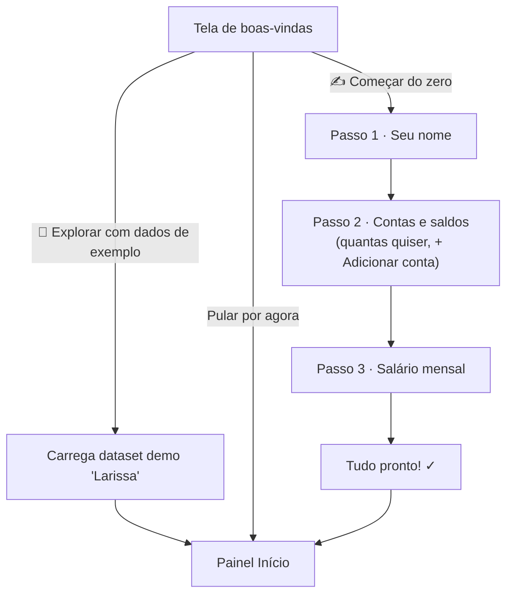
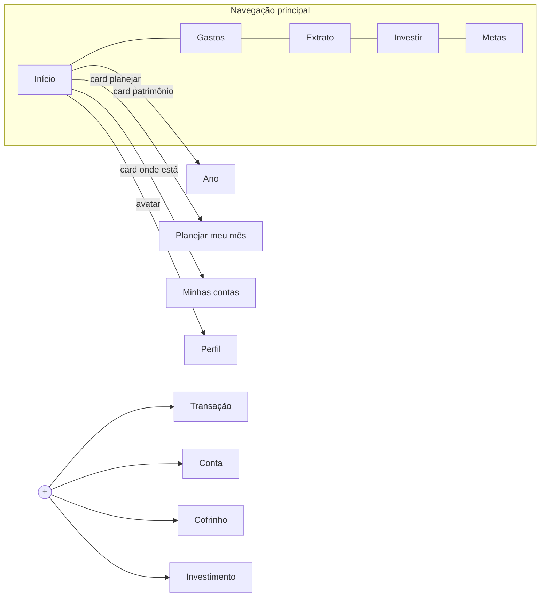
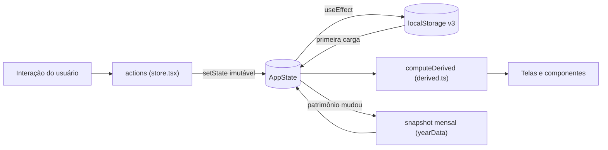
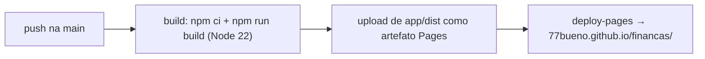

# Finanças — Documentação completa

Plataforma de organização financeira pessoal: contas, gastos com descrição livre, categorias próprias, investimentos, metas, planejamento mensal e histórico de patrimônio — tudo num só lugar, funcionando como site responsivo **e** como app instalável (PWA).

- **Produção:** https://77bueno.github.io/financas/
- **Repositório:** https://github.com/77bueno/financas
- **Código-fonte do app:** pasta [`app/`](../app)

---

## Índice

1. [Visão geral](#1-visão-geral)
2. [Acesso e instalação](#2-acesso-e-instalação)
3. [Fluxos do usuário](#3-fluxos-do-usuário)
4. [Navegação e layout responsivo](#4-navegação-e-layout-responsivo)
5. [Arquitetura técnica](#5-arquitetura-técnica)
6. [Modelo de dados](#6-modelo-de-dados)
7. [Regras de cálculo](#7-regras-de-cálculo)
8. [Persistência e privacidade](#8-persistência-e-privacidade)
9. [PWA (app instalável)](#9-pwa-app-instalável)
10. [Desenvolvimento e deploy](#10-desenvolvimento-e-deploy)
11. [Limitações conhecidas e roadmap](#11-limitações-conhecidas-e-roadmap)

---

## 1. Visão geral

| | |
|---|---|
| **Stack** | React 19 + TypeScript + Vite 8 |
| **Estado** | React Context + `useState`, sem bibliotecas externas |
| **Persistência** | `localStorage` do navegador (chave `financas-app-state-v3`) |
| **Estilo** | CSS-in-JS inline + um `index.css` global (breakpoints, animações) |
| **PWA** | `vite-plugin-pwa` (service worker com cache offline, manifest, ícones) |
| **Deploy** | GitHub Actions → GitHub Pages, automático a cada push na `main` |
| **Backend** | Não há. Tudo roda e fica no dispositivo do usuário. |

**Princípios do produto:**

- A plataforma **nasce zerada** — todo número na tela vem do que o usuário cadastrou. Não existe valor decorativo.
- **Tudo que aparece é clicável/editável**: transações, contas, investimentos e cofrinhos abrem uma folha de edição ao toque.
- Um **modo demo** opcional (dados fictícios da "Larissa") existe para explorar a plataforma preenchida, e pode ser carregado/descartado a qualquer momento pelo perfil.

---

## 2. Acesso e instalação

### Como site
Abra https://77bueno.github.io/financas/ em qualquer navegador (celular, tablet ou computador).

### Como app (PWA)
- **Android / Chrome:** menu ⋮ → "Adicionar à tela inicial" (ou aceite o banner de instalação).
- **iPhone / Safari:** botão compartilhar → "Adicionar à Tela de Início".
- **Desktop / Chrome ou Edge:** ícone de instalação na barra de endereço.

Depois de instalado, o app abre em janela própria (sem barra do navegador), tem ícone na tela inicial e **funciona offline** — o service worker guarda o app em cache e os dados já ficam no dispositivo.

> **Atualizações:** a cada deploy o service worker baixa a versão nova em segundo plano e a aplica na recarga seguinte (`registerType: autoUpdate`). Se uma mudança não aparecer, recarregue com `Ctrl/Cmd+Shift+R`.

---

## 3. Fluxos do usuário

### 3.1 Primeiro acesso (onboarding)



- Cada passo tem botão **‹ voltar**.
- Contas deixadas totalmente em branco no passo 2 são descartadas ao concluir.
- O nome é usado na saudação ("Bom dia, …"), no avatar (inicial) e pode ser trocado depois no perfil.

### 3.2 Registrar transações

Botão **+** (tab bar no celular / "+ Adicionar" no header do desktop) → **Transação**, ou atalhos "Registrar primeira transação" nos estados vazios.

Campos da folha "Nova transação":

| Campo | Comportamento |
|---|---|
| **Tipo** | Despesa · Receita · Transferência (segmentado) |
| **Descrição** | Texto livre — ex.: *"Assinatura Claude"*, *"Faculdade"*, *"Final de semana"*, *"Conta do celular"*. Se vazio, usa o nome da categoria |
| **Data** | Padrão hoje; editável (lançamento retroativo entra no mês correto dos relatórios) |
| **Valor** | Campo digitado com formatação ao vivo em centavos: digitar `12050` exibe `R$ 120,50` |
| **Conta** | Chips com suas contas. Despesa/transferência **debita** a conta escolhida; receita **credita**. Transferência pede também a conta de destino ("entra na conta") e move o dinheiro entre as duas. Opcional: sem conta selecionada, os saldos não mudam |
| **Categoria** | Só para despesas. Chips com as categorias existentes + **"+ nova categoria"** |

- **Os saldos das contas atualizam automaticamente** — inclusive ao **editar** (o efeito antigo é revertido e o novo aplicado) e ao **excluir** (o efeito é revertido).
- **Transferência** não conta como gasto por categoria **nem** no Entrou/Saiu do mês — é dinheiro movendo entre contas suas.
- Salvar mostra um toast de confirmação e a transação aparece na Início e no Extrato.

### 3.3 Categorias personalizadas

Na folha de transação, com tipo Despesa → **"+ nova categoria"**:

1. Digite o nome (ex.: *Educação*).
2. Escolha um emoji (🎓 📱 👕 🎮 ✈️ …).
3. **Criar categoria** — ela recebe uma cor automática da paleta, já sai selecionada e passa a aparecer nos chips, no relatório de gastos (donut e lista) e nos filtros do extrato.

Nomes duplicados (ignorando maiúsculas) não criam categoria nova — apenas selecionam a existente. As 7 categorias padrão: Alimentação, Transporte, Moradia, Lazer, Saúde, Assinaturas, Outros.

### 3.4 Extrato

Aba **Extrato** (header desktop) ou **"Ver todas ›"** na Início / **"ver extrato ›"** em Gastos.

- Lista completa de transações **agrupadas por dia** (Hoje, Ontem, "28 jun"…).
- **Busca por texto** na descrição e categoria (ex.: buscar "claude").
- **Filtros em chips**: Todas · Despesas · Receitas · uma chip por categoria usada.
- **Tocar numa transação** abre a folha de edição: alterar tipo, descrição, valor, categoria, ou **Excluir**.

### 3.5 Contas (onde guardo)

Card **"Onde está meu dinheiro"** na Início → tela **Minhas contas**.

- Contas em dois grupos: **DISPONÍVEL** (conta corrente, carteira…) e **GUARDADO** (reserva, poupança).
- **+ Adicionar conta** (na tela ou via hub do +): nome, saldo e o grupo (toggle 💳 Disponível / 🐷 Guardado).
- **Tocar numa conta** abre a edição: renomear, ajustar saldo, trocar de grupo ou **Excluir**.
- A tela mostra também o **patrimônio líquido** (patrimônio − fatura do cartão, se cadastrada no perfil) e a seção **A PAGAR** quando há fatura.

### 3.6 Investimentos

Aba **Investir**.

- Card com o **total investido** e a contagem de ativos.
- **Carteira**: cada ativo com valor e % da carteira. **Tocar** edita nome/valor ou exclui.
- **+ Adicionar investimento**: nome (ex.: *CDB*, *Tesouro Selic*) e valor aplicado.
- Investimentos somam no patrimônio total e aparecem na barra de alocação da Início.

### 3.7 Metas / cofrinhos

Aba **Metas**.

- Card-resumo com **total guardado** vs. total das metas.
- Cada cofrinho mostra progresso (% e barra). **Tocar** abre a edição: nome, **"guardado até agora"** (é assim que se registra um aporte), meta a atingir, ou **Excluir**.
- **+ Criar novo cofrinho**: nome + meta a atingir.

### 3.8 Planejar meu mês

Card **"🧮 Planejar meu mês"** na Início.

1. **Salário** editável (o mesmo do perfil/onboarding).
2. **Dívidas e contas fixas**: lista editável (nome + valor, ✕ para remover, + Adicionar conta). Mostra o **comprometimento** (% do salário) com semáforo: verde ≤ 30% · amarelo 31–40% · rosa > 40%.
3. **Slider "quanto investir"** (0–100%, passos de 5) sobre o que sobra após as dívidas.
4. **Resultado ao vivo**: Dívidas / Dia a dia / **Sobra pra investir**, com barra proporcional — tudo recalcula a cada tecla.

### 3.9 Relatório de gastos

Aba **Gastos** — sempre referente ao **mês atual** (o título mostra mês/ano).

- **Donut** por categoria (proporções reais dos seus lançamentos) com total gasto no centro.
- Lista de categorias ordenada por valor, com % dos gastos e total.
- Sem gastos no mês → estado vazio com botão "+ Registrar um gasto".

### 3.10 Ano (histórico de patrimônio)

Badge no card de patrimônio da Início → tela **"Seu ano até aqui"**.

- O app grava **um snapshot do patrimônio por mês, automaticamente** (atualiza o mês corrente sempre que o patrimônio muda; guarda até 12 meses).
- Com 2+ meses: gráfico de barras da evolução + crescimento no período e no mês.
- Com 1 mês: aviso de que o histórico começa a aparecer no mês seguinte.
- **Destaques**: quanto o patrimônio cresceu desde o primeiro registro, total investido, guardado em metas e gasto do mês.

### 3.11 Perfil

Avatar (inicial do nome) no header do desktop ou na Início do celular.

| Seção | O que faz |
|---|---|
| **Seu nome** | Edita o nome usado na saudação/avatar |
| **Dados do mês** | Salário mensal e **fatura do cartão** (opcional — vira "A PAGAR" e desconta do patrimônio líquido) |
| **Resumo** | Patrimônio, nº de contas, investimentos, metas e transações |
| **Meus dados** | 🔎 **Carregar dados de exemplo** (substitui tudo pelo demo) · 🗑 **Apagar todos os dados** (com confirmação; volta ao onboarding) |

> Aviso exibido no app: os dados ficam **somente no dispositivo** (navegador). Nada é enviado a servidor.

---

## 4. Navegação e layout responsivo

O app ocupa **a tela inteira** em qualquer tamanho (sem molduras). Três faixas de layout:

| Largura | Navegação | Conteúdo |
|---|---|---|
| < 640px (celular) | **Tab bar inferior**: Início · Gastos · **+** · Investir · Metas | Coluna única |
| 640–1099px (tablet) | **Header horizontal**: logo, Início/Gastos/Extrato/Investir/Metas, "+ Adicionar", avatar | Coluna única |
| ≥ 1100px (desktop) | Mesmo header | **Duas colunas** por tela; conteúdo centrado com máx. 1320px |

- Telas acessadas por dentro (Extrato, Minhas contas, Planejar, Ano, Perfil) têm botão **‹ voltar**.
- As folhas (sheets) de adicionar/editar sobem de baixo; no desktop ficam limitadas a 560px centralizados.
- `safe-area-inset` aplicado em tab bar, folhas e toast (notch/home indicator).



---

## 5. Arquitetura técnica

### 5.1 Estrutura de pastas

```
app/
├── index.html                  # metatags PWA/mobile, fontes (Sora, Space Grotesk)
├── vite.config.ts              # base /financas/, plugin PWA (manifest + workbox)
├── public/
│   ├── favicon.svg             # marca "R$" (gradiente roxo)
│   ├── apple-touch-icon.png
│   └── pwa/icon-{192,512,512-maskable}.png
└── src/
    ├── main.tsx                # bootstrap React
    ├── App.tsx                 # shell: TopNav + roteador de telas + folhas + TabBar
    ├── index.css               # reset, breakpoints, grids, animações
    ├── state/
    │   ├── types.ts            # todos os tipos (AppState, Txn, Category…)
    │   ├── constants.ts        # categorias padrão, paleta, emojis, meses
    │   ├── initialState.ts     # estado zerado + dataset demo
    │   ├── store.tsx           # Context + todas as ações + persistência + snapshots
    │   └── derived.ts          # TODOS os valores calculados (puro, sem efeitos)
    ├── utils/format.ts         # fmt (BRL), parseDigits, datas ISO, dateLabel
    ├── components/
    │   ├── TopNav.tsx          # header desktop/tablet
    │   ├── TabBar.tsx          # abas inferiores mobile
    │   ├── Hub.tsx             # menu do "+"
    │   ├── AddTransactionSheet.tsx  # criar/editar transação + nova categoria
    │   ├── QuickAddSheet.tsx   # criar conta/cofrinho/investimento
    │   ├── EditSheet.tsx       # editar/excluir conta/cofrinho/investimento
    │   ├── AmountField.tsx     # campo de valor em centavos formatado ao vivo
    │   └── Toast.tsx           # confirmações
    └── screens/
        ├── Onboarding.tsx  ├── Home.tsx    ├── Spend.tsx  ├── Txns.tsx
        ├── Invest.tsx      ├── Goals.tsx   ├── Wealth.tsx ├── Plan.tsx
        ├── Year.tsx        └── Profile.tsx
```

### 5.2 Fluxo de dados



- **Uma única fonte de verdade** (`AppState`) num Context; componentes consomem via hook `useFinance()` → `{ state, actions, derived }`.
- **`derived.ts` é uma função pura**: recebe o estado e devolve todos os valores exibidos (strings formatadas, %, cores, donut, barras). Nenhuma tela faz conta própria — se um número aparece na UI, a regra está em `derived.ts`.
- **Ações** são `useCallback`s que fazem `setState` imutável; nada de reducers externos ou bibliotecas.
- **Persistência**: um `useEffect` grava o estado inteiro no `localStorage` a cada mudança; na carga, campos transitórios (folhas abertas, toasts, edição em andamento) são resetados.
- **Snapshot mensal**: um `useEffect` observa o patrimônio (contas + investimentos) e faz *upsert* do mês corrente em `yearData` (ignorado durante o onboarding; máx. 12 meses).

### 5.3 Convenções de UI

- **Valores monetários digitados**: todo campo de valor usa o padrão "fluxo de dígitos" — o input guarda centavos (`parseDigits`) e re-renderiza formatado (`fmt`). Sem máscara de cursor, sem teclado custom.
- **Folhas (bottom sheets)**: criação e edição acontecem em folhas sobre a tela atual, nunca em páginas separadas — o contexto do usuário é preservado.
- **Toast único** com mensagem específica da ação ("✓ Conta adicionada", "✓ Transação excluída"…), auto-dismiss em 1,8s.
- **Estados vazios** sempre têm um CTA que abre o fluxo de criação correspondente.

---

## 6. Modelo de dados

Tipos principais (completos em [`app/src/state/types.ts`](../app/src/state/types.ts)):

| Entidade | Campos | Observações |
|---|---|---|
| `Txn` | `id, desc, cat, icon, date (ISO), amount, accountId?, toAccountId?` | `amount` > 0 = receita; < 0 = saída. `cat` especial: `"Receita"`, `"Transferência"`. `accountId` = conta debitada/creditada; `toAccountId` = destino da transferência |
| `Category` | `id, name, icon, color, bg` | 7 padrão + criadas pelo usuário (paleta em rotação) |
| `Account` | `id, icon, name, bank, value, group` | `group`: `'disp'` (disponível) ou `'reserva'` (guardado) |
| `Investment` | `id, name, value, cls, ret, good, color` | `cls/ret` são rótulos exibidos; aportes novos entram como `"aporte"` |
| `Goal` | `id, icon, name, sub, saved, target, color` | progresso = `saved/target` (limitado a 100%) |
| `Debt` | `id, name, value` | usado só no Planejar meu mês |
| `YearPoint` | `key ("YYYY-MM"), m ("Jul"), v` | snapshot mensal do patrimônio |

Campos avulsos do `AppState`: `userName`, `salary`, `cardBill`, `investPct`, `screen`, e o estado transitório das folhas (adicionar/editar/nova categoria).

---

## 7. Regras de cálculo

Todas implementadas em [`app/src/state/derived.ts`](../app/src/state/derived.ts):

| Valor | Regra |
|---|---|
| **Patrimônio total** | soma de todas as contas + todos os investimentos |
| **Patrimônio líquido** | patrimônio − fatura do cartão (`cardBill`) |
| **Alocação (barra da Início)** | proporção investido / reserva / disponível sobre o patrimônio |
| **Entrou / Saiu / Sobrou** | somas das transações **do mês corrente** (positivas / negativas / diferença), **excluindo transferências** entre contas próprias |
| **Saldo das contas** | ajustado automaticamente por cada transação vinculada a conta: criar aplica o efeito, editar reverte o antigo e aplica o novo, excluir reverte |
| **Gastos por categoria (donut)** | transações negativas do mês, **excluindo Transferência**, agrupadas por `cat`; segmentos do donut são um `conic-gradient` gerado com as cores das categorias |
| **Insight da Início** | aparece só quando `sobrou > 0`: "sobraram R$ X — que tal investir?" |
| **Comprometimento (planner)** | dívidas ÷ salário; verde ≤ 30%, amarelo 31–40%, rosa > 40% |
| **Sobra pra investir** | `(salário − dívidas) × investPct%`; "dia a dia" é o restante |
| **Crescimento no mês** | último snapshot ÷ penúltimo − 1 (precisa de 2+ meses) |
| **Crescimento no período (Ano)** | último snapshot ÷ primeiro − 1 |
| **Progresso da meta** | `saved ÷ target`, limitado a 100% |

---

## 8. Persistência e privacidade

- **Onde:** `localStorage` do navegador, chave `financas-app-state-v3`. Nenhum dado sai do dispositivo; não há servidor, conta ou login.
- **Quando:** a cada mudança de estado (efeito no store).
- **Versão:** a chave é versionada (`-v3`). Mudanças estruturais incompatíveis trocam a versão — o app então recomeça zerado (dados antigos permanecem órfãos na chave anterior).
- **Reset:** "Apagar todos os dados" no perfil remove a chave e volta ao onboarding.
- **Implicações:** limpar dados do navegador apaga tudo; os dados não sincronizam entre dispositivos (ver roadmap).

---

## 9. PWA (app instalável)

Configuração em [`app/vite.config.ts`](../app/vite.config.ts) via `vite-plugin-pwa`:

- **Manifest:** nome "Finanças", `display: standalone`, `orientation: portrait`, tema `#150f2c`, fundo `#0a0814`, `start_url`/`scope` = `/financas/`.
- **Ícones:** 192px e 512px (`purpose: any`) + 512px maskable (Android), + `apple-touch-icon` 180px — todos com a marca da moeda no gradiente roxo do app.
- **Service worker:** gerado pelo Workbox (`generateSW`), pré-cacheia todos os assets (`js/css/html/svg/png/woff2`) → o **app shell abre offline**; `registerType: autoUpdate` troca a versão automaticamente.
- **Meta tags** iOS/Android em `index.html` (`apple-mobile-web-app-*`, `theme-color`, `viewport-fit=cover`).

---

## 10. Desenvolvimento e deploy

### Rodar localmente

```bash
cd app
npm install
npm run dev        # http://localhost:5173/financas/
```

### Scripts

| Comando | O que faz |
|---|---|
| `npm run dev` | servidor de desenvolvimento (Vite, HMR) |
| `npm run build` | typecheck (`tsc -b`) + build de produção + service worker |
| `npm run preview` | serve o build de produção localmente |
| `npm run lint` | oxlint |

### Deploy (automático)

Workflow em [`.github/workflows/deploy.yml`](../.github/workflows/deploy.yml):



Não há passo manual: fazer merge/push na `main` publica. O `base: '/financas/'` no Vite alinha os caminhos com a URL do GitHub Pages.

---

## 11. Limitações conhecidas e roadmap

**Limitações atuais (por design ou escopo):**

- Sem recorrência (assinaturas mensais precisam ser lançadas a cada mês).
- Rendimento de investimentos é um rótulo informativo, não calculado.
- Dados não sincronizam entre dispositivos (100% local).
- Categorias podem ser criadas, mas ainda não renomeadas/excluídas.
- O relatório de gastos mostra apenas o mês corrente (sem navegar meses anteriores).

**Roadmap sugerido (em ordem de impacto):**

1. **Despesas recorrentes** (assinaturas geradas automaticamente todo mês).
2. **Orçamento por categoria** (limite mensal + barra de progresso + alerta de estouro).
3. **Navegar meses anteriores** no relatório de gastos.
4. Gerenciar categorias (renomear, excluir, reordenar).
5. Exportar/importar dados (JSON/CSV) — também resolve backup e migração de dispositivo.
6. Desfazer exclusões pelo toast.
7. Modo claro (tema).
8. Sincronização opcional em nuvem (exigiria backend + autenticação).
